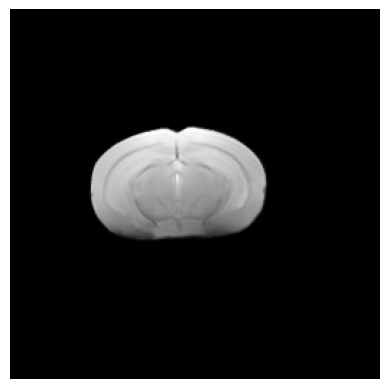
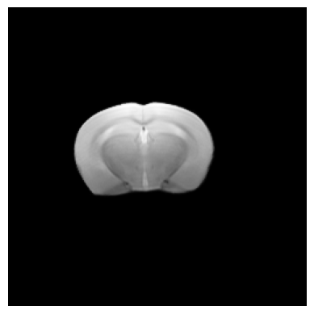
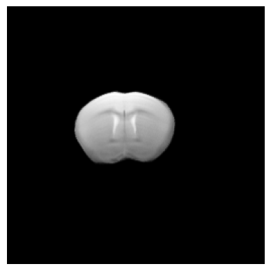
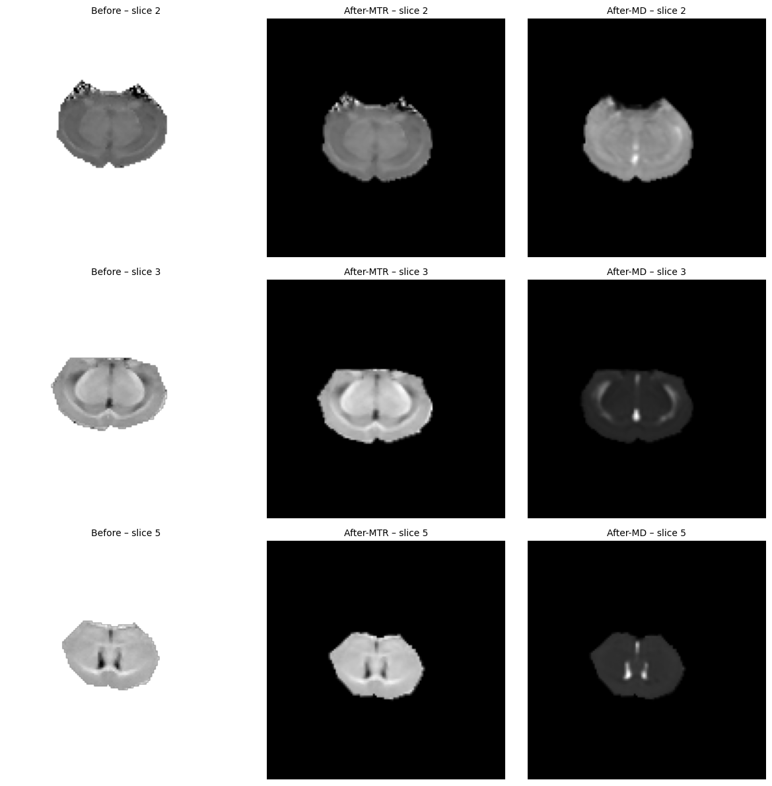
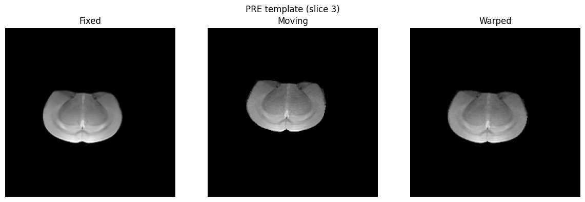
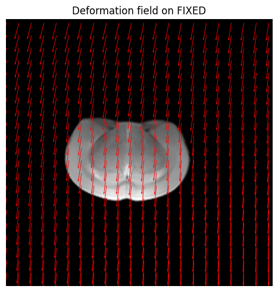
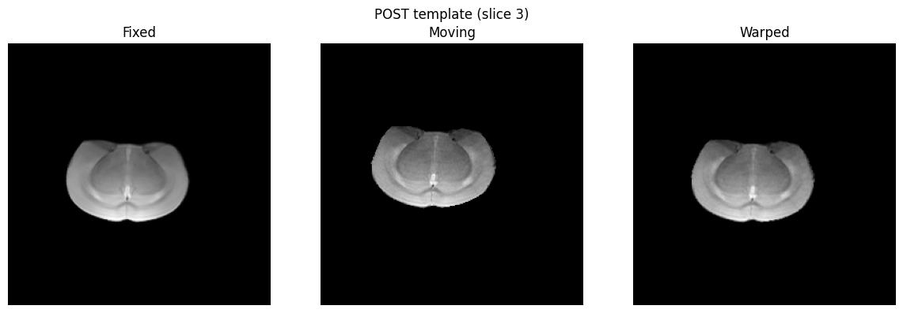
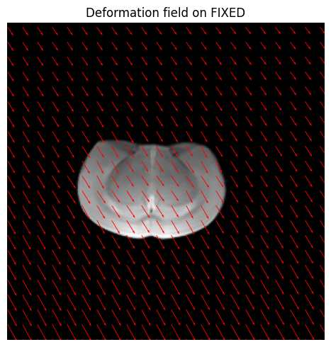

# Biomedical Image Analysis

# Image Registration. Applied example

## Part 1 - Registration and image comparison

### Objectives

-   Adapt the code to your images and computer.
-   Obtain a template of the T2w images for slices 2,3 and 5. Prepare a pdf document and show the images obtained.
-   Register the T2w images and the MTR, FA, AD, RD and MD maps to the template. Provide representative images, for one animal (all slices), before the registration and after the registration, for the MD and MTR maps. Comment on the qualitative (or quantiative) differences between the images before and after registration.

### Results

***Note:*** *The code used to produce the images shown in this document can be found within the jupyter notebook together with this document in the zip folder.*

The following is the template of the T2w images obtained for slices 2,3 and 5:

| Slice 2 | Slice 3 | Slice 5 |
|------------------------|------------------------|------------------------|
|  |  |  |

Representative images from 'R112' before and after registration (for MD and MTR maps) are shown below:



### Observations

After registration with the magnetization transfer ratio (MTR) map, it is possible to see the lighter gray areas and medium gray areas slightly lighter than in the image before, specially in slice 3. This is because it shows higher magnetization transfer, indicating areas of denser tissue.

With regards to the mean diffusivity (MD) map. Here we see higher values in slice 2, this indicates there is more free water diffusion. Whilst slice 3 and 5 show very low water diffusion, allowing this diffusion only within few central spots in the brain. These show the opposite to what we see in the images after MTR: the lighter these images are, the darker in the MD, and the other way around. This makes sense, because the higher the tissue density the lesser the water will be allowed to pass.

## PART 2 - Displacement

### Background

When using the ANTsPy library’s ants.registration function, the output includes the transformation that maps the moving image to the fixed image. To check the displacement associated with this transformation, one can extract the displacement field (the warp field) from the registration result. This displacement field image encodes, at each voxel, how much that voxel should be displaced to align moving to fixed image. Thus, the displacement associated with the registration is given by this displacement field transform. You can analyze or visualize it voxel-wise as 3D vectors

### Objectives

-   Create a code that, for one animal and in slice 3, registers the images (both in “pre” condition and “post” condition, independently) to the templates, and extract the following information:
-   Create a function visualize_transformation (fixed_image, moving_image, warped_image (the registered image), registration_result) that:
    1.  Displays the fixed, moving, and warped images side by side
    2.  Creates a grid of points in the fixed image space
    3.  Applies the inverse transformation to these points
    4.  Visualizes the deformation field using quiver plots
    5.  Includes proper error handling if the transformation visualization fails
    6.  Apply this visualization to both registration results.

### Results and Observations

We registered, or aligned, the T2-weighted slice (slice 3) to the template of slice 3 of animal 'R112'.

-   The 'Fixed' image is the template image - the reference that defines the target coordinate system. All other images are warped so that their anatomical structures align with this one.

-   The 'Moving' image is the original (unregistered) T2w image, in its own coordinate space.

-   The 'Warped' image is the 'Moving' image after registration. This occurs after the algorithm estimates a spatial transformation that brings this image into the same space as the 'Fixed' template.

**Images PRE-condition**

 

> If we look at the at the PRE 'Moving' image, we can see that is slightly off centered to the top, in fact, the quiver plot, shows that the voxels mainly move downwards in order to correct the positioning. The resulting 'Warped' image looks in the exact same position as the 'Fixed', indicating registration succeeded.

**Images POST-condition**

 

> By looking at the POST 'Moving' image, is easily appreciated that it is slightly to the top-left when compared to the 'Fixed'. And this is validated by the quiver plot, where we can observe the deformation field moved down and to the right, performing a slight global shift of all the voxels.

For both the PRE and POST conditions, the moving slice 3 images were successfully aligned to the template. The PRE field is oriented slightly differently from the POST field, showing possible small differences in head positioning or acquisition geometry between sessions rather than true anatomical changes.

## PART 3 - Calculation of Registration Metrics

### Objectives

Create a function calculate_transformation_metrics(fixed_image, moving_image, warped_image) that computes:

-   Cross-correlation between fixed and warped images: Evaluates the linear **similarity** between the intensities of the fixed image (template) and the warped image.

-   Mean squared difference between fixed and warped images: measures the mean square **difference** between intensities.

-   Jacobian determinant statistics of the deformation field (min, max, mean): measures how much is the space deformed during registration. Obtaining measurements from the local expansion/contraction induced by the deformation.

Calculate these metrics for both registration results.

### Results

```         
PRE metrics:
{'cross_correlation': 0.9981268667397248,
 'mse': 0.04203246887511568,
 'jac_min': 0.7872021198272705,
 'jac_max': 1.2220062017440796,
 'jac_mean': 0.999999999990905}

 POST metrics:
{'cross_correlation': 0.9972212926407941,
 'mse': 0.13926668906083708,
 'jac_min': 0.7695508599281311,
 'jac_max': 1.3251433372497559,
 'jac_mean': 0.9999999999072315}
```

## PART 4 - Comparison and Analysis

### Objectives:

Create a function to compare the results from the two different moving images:

-   Create a table or visualization comparing the metrics
-   Analyze the differences in the deformation fields
-   Discuss which image registered better and why

Write a brief analysis (300-500 words) explaining:

-   The differences observed between the two registrations
-   How the initial differences between the moving images affected the registration
-   Which metrics are most informative for assessing registration quality
-   How the deformation field visualization helps understand the transformation

```         
=== Registration Metrics Comparison ===
      cross_correlation     mse  jac_min  jac_max  jac_mean
PRE              0.9981  0.0420   0.7872   1.2220       1.0
POST             0.9972  0.1393   0.7696   1.3251       1.0
```

The metrics between fixed and warped images in the PRE and POST-condition both show high cross correlation, indicating the images had very similar intensities, this reflects that the structures are very well aligned and registration worked well. However, the PRE-model has slightly better alignment with the template than the POST. This could indicate that after 6 weeks there are structural variations in the anatomy of that make it difficult to achieve a perfect fit.

We can observe a similar patterns on the MSE (mean squared error), confirming the previous argument. Where both images are very similar to the template (both close to 0 differences), however there is slightly more difference with the POST- model, since it shows a slightly higher error.

Lastly, when looking at the jacobian determinant, we can see that the mean in around 1 for both images. We can say that there are no global volumetric changes and registration was well balanced. If we look at the ranges (min-max) of both cases, we can see that there is a larger range of variation for the POST-model. Indicating that there was more expansion/contraction of the regions to achieve an alignment. This could have been affected also by the fact that the POST moving image was initially further away from the location of the template. The quiver plots help to visualize these displacements since we can easily see the direction of the transformation.

All this shows that although both registrations are successful, the PRE-condition required less deformation and thus achieved a more stable, faithful alignment to the template.

In order to assess registration quality, the registration metrics that are more informative are the *cross correlation* and the *MSE*, since they directly measure intensity alignment making them most reliable to assess registration quality.