# Segmentación básica

## Umbralización

Umbralización de imágenes es un caso particular del recorte, cuyo objetivo principal es la segregación, separación o segmentación de los dos niveles o clases de una imagen bimodal a las que solemos referirnos como frente y fondo.

**Objetivo**: umbralizar una imagen en escala de grises que, en principio, no es bimodal, pero en la cual puede apreciarse una clase diferenciada.

``` splus
% Cargar y representar MRI_gray.jpg con su histograma
img = imread('Imagenes_P3\MRI_gray.jpg');
E_img  = calcularEnergia(img);
imshow(img); title(sprintf('Imagen original E=%.5g', E_img));
exportgraphics(gcf, 'results/ej1.png', 'Resolution',150);

% Histograma
histFig = figure; imhist(img); axis('tight');
exportgraphics(histFig, 'results/img_1_hist.png');
```

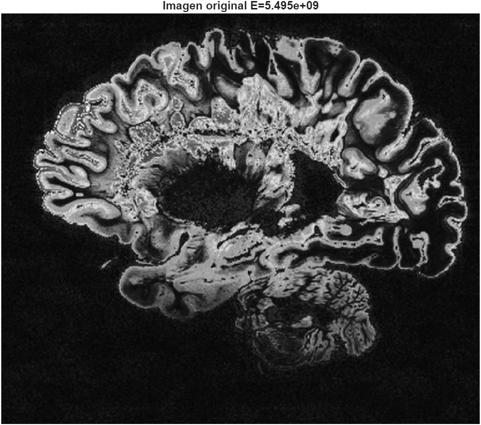

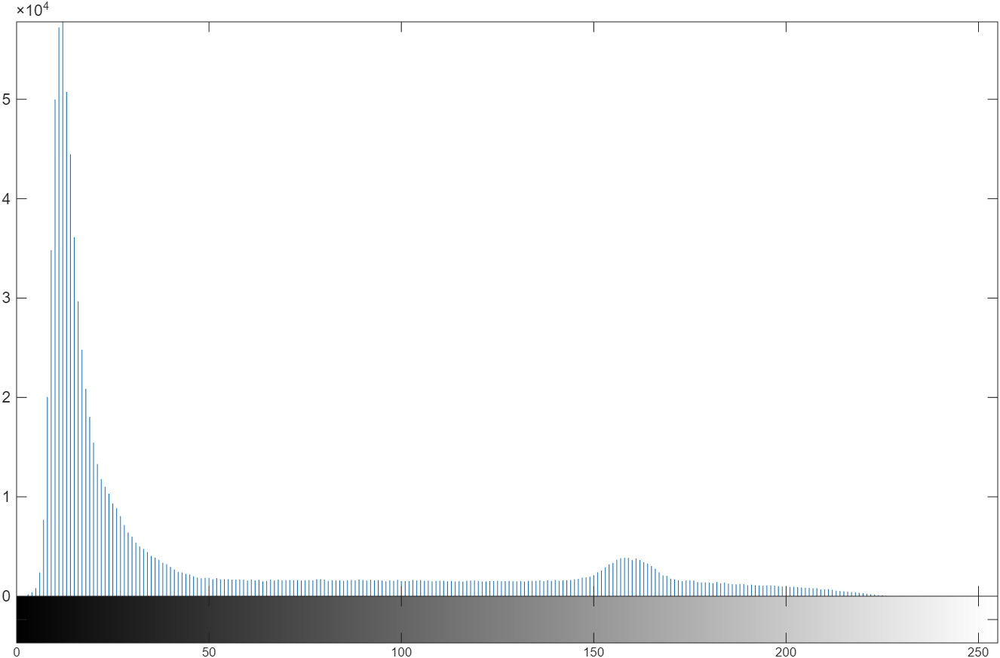

### Umbralización global de imágenes bimodales

*Paso 1*: Generamos una función que implemente un esquema de búsqueda iterativa del umbral que equidiste de las medias superior e inferior.

``` splus
% Función: UmbralizaGlobal
% Definimos la función
function [mascara, umbral] = UmbralizaGlobal(ima)
    I = double(ima);    
    r_min = min(I(:)); 
    r_max = max(I(:));

    % 1) umbral inicial
    T_in = (r_max - r_min)/2;

    while true
        % 2) separar con T_in = T
        g1 = I <= T_in;
        g2 = I >  T_in;
        m1 = mean(I(g1));
        m2 = mean(I(g2));
        T_out = (m1 + m2)/2; 
        
        if abs(T_out - T_in) < 1
            umbral = T_out;
            break
        end
        T_in = T_out;
    end
    % Salida
    mascara = I > umbral;
end
```

> Esta función recibe una imagen en escala de grises (tipo uint8) y devuelve una máscara binaria (lógica), es decir, con los píxeles cuyo valor de gris esté por encima del umbral detectado a ‘1’ y el resto a ‘0’, y el umbral calculado.

*Paso 2*: Calcular la máscara con la función anterior y mostrar su histograma:

``` splus
% Llamar función
[mask, T] = UmbralizaGlobal(img);
% Mascara binaria
E_mask  = calcularEnergia(mask);
figure; imshow(mask); title(sprintf('Máscara binaria E=%g (T=%.1f)',E_mask, T));
exportgraphics(gcf, 'results/img_1_mask.png', 'Resolution',150);

% Histograma
histFig2 = figure; imhist(mask); axis('tight');
exportgraphics(histFig2, 'results/img_1_histmask.png');
```

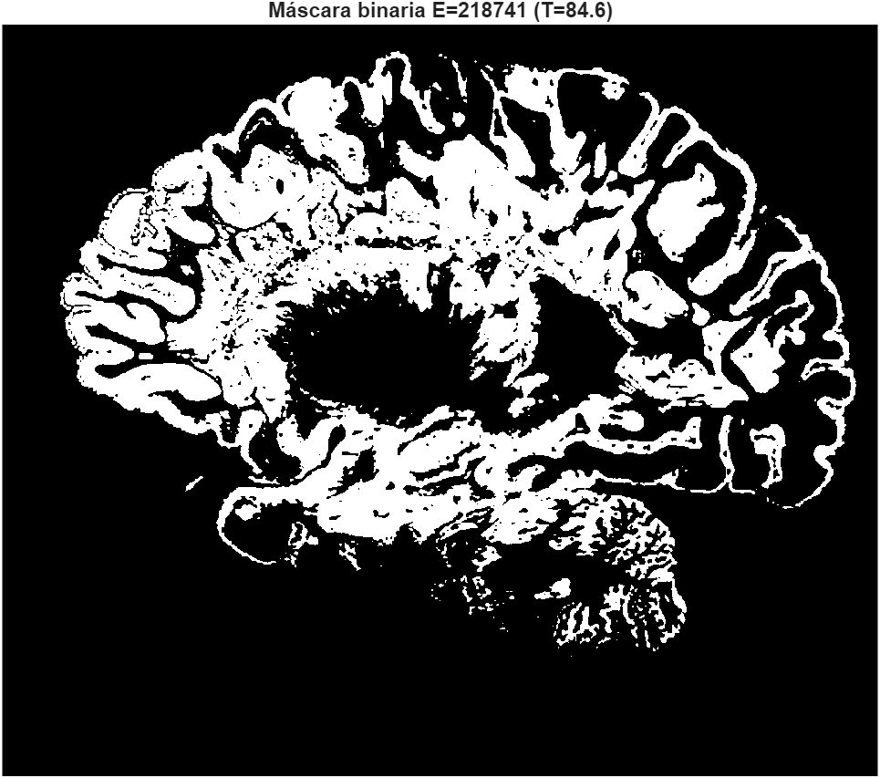

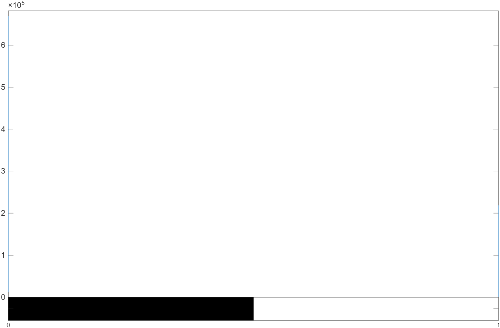

*Paso 3*: Generar imagen enmascarada (multiplicar la máscara por la imagen original) y mostrar su histograma (sin `axis 'tight'`):

``` splus
% Generar imagen enmascarada
maskedImg = img .* uint8(mask);
E_maskedImg = calcularEnergia(maskedImg);
figure; imshow(maskedImg); title(sprintf('Imagen enmascarada E=%.5g (T=%.1f)', E_maskedImg, T));
exportgraphics(gcf, 'results/img_1_masked.png', 'Resolution',150);

% Histograma
histFig3 = figure; imhist(maskedImg); % axis('tight');
exportgraphics(histFig3, 'results/img_1_histmasked.png');
```

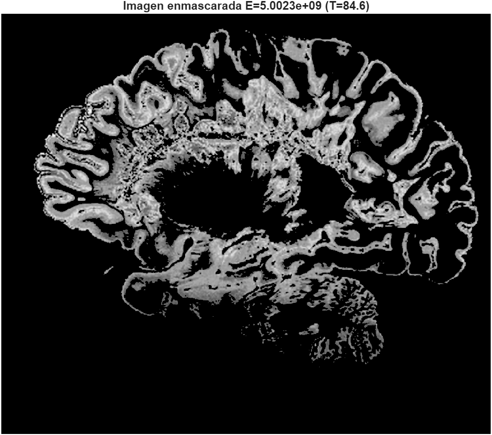 *Imagen enmascarada*

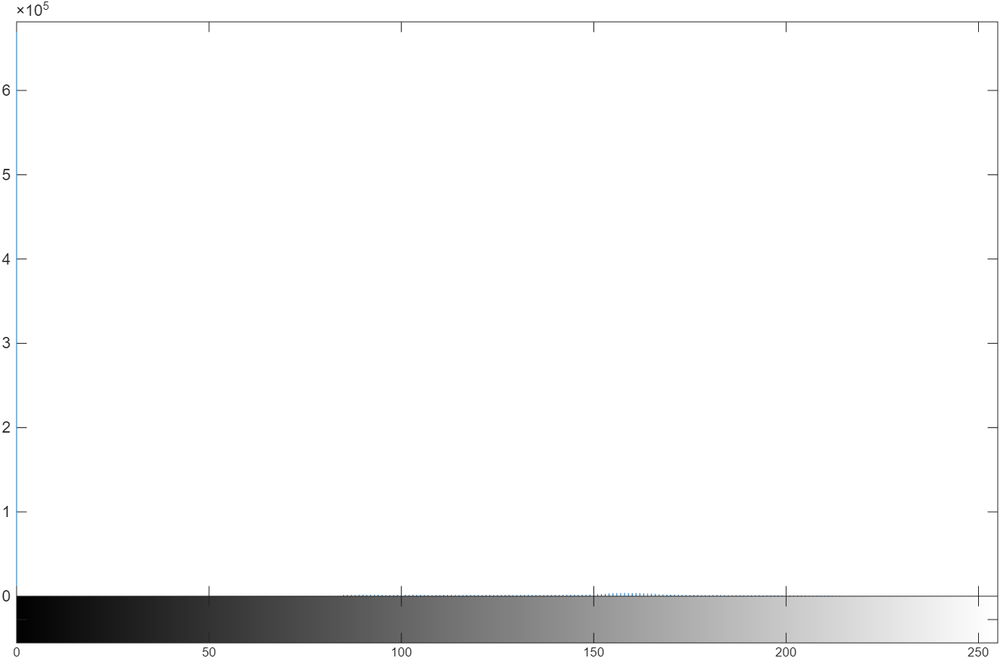 *Histograma con `axis 'tight'`*

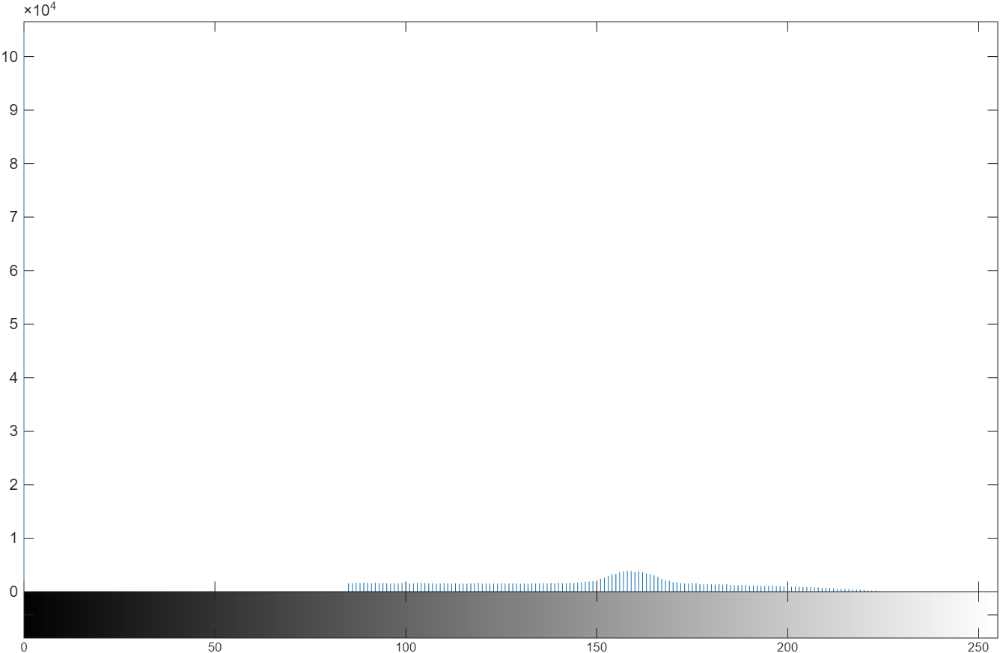 *Histograma sin `axis 'tight'`*

#### Observaciones sobre el uso o no de `axis 'tight'`

Si usamos axis tight vemos el largo total del pico gigante en 0, que en la escala del eje y llega a aproximadamente a $6'5x10^5$, sin embargo los pocos valores que se encuentran en grises medios y claros apenas se aprecian a esa escala. Mientras que si no lo usamos, la escala del eje y se queda en $10x10^4$, lo que nos permite ver la pequeña loma que se encuetnra entre el 80-220 aproximadamente, ganando legibilidad.

#### Comparison:

``` splus
% Umbralización global (de imágenes bimodales)

% Cargar img
img = imread('Imagenes_P3\MRI_gray.jpg');

% Llamar función (mascara binaria)
[mask, T] = UmbralizaGlobal(img);

% Generar imagen enmascarada
maskedImg = img .* uint8(mask);

% Calcular energías
E_img  = calcularEnergia(img);
E_mask  = calcularEnergia(mask);
E_maskedImg = calcularEnergia(maskedImg);

% Mostrar imagenes
figure;
subplot(2,3,1); imshow(img); title(sprintf('Imagen original E=%.5g', E_img));
subplot(2,3,2); imshow(mask); title(sprintf('Máscara binaria E=%g (T=%.1f)',E_mask, T));
subplot(2,3,3); imshow(maskedImg); title(sprintf('Imagen enmascarada E=%.5g (T=%.1f)', E_maskedImg, T));
subplot(2,3,4); imhist(img); axis('tight');
subplot(2,3,5); imhist(mask); axis('tight');
subplot(2,3,6); imhist(maskedImg);

exportgraphics(gcf, 'results/ex_1.png', 'Resolution',150);
```


#### Observaciones

Podemos ver que la energía inicial y final de la imagen procesada es bastante similar. De hecho, los cambios de una imagen a la otra son pocos a simple vista, hemos reducido los grises oscuros de la escena, especialmente en la siguiente zona:

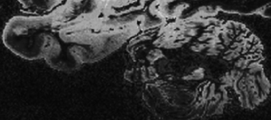 *Antes*

 *Después*

Esto causa un cambio brusco de grises medios a negro.

Con respecto a los histogramas, podemos ver que de una transcisión suave de negro a grises oscuros, que teníamos en la imagen original, generamos un pico enorme en el negro y ausencia de pixeles hasta el valor 80. A partir de este valor, la transcicion de grises medios a claros, que teníamos antes, se mantiene.

### Umbralización global por el método de Otsu

*Paso 1*: Generamos una función que implemente un esquema de búsqueda exhaustiva (no itera hasta converger,sino que hace búsqueda de 0 a 254, calcula $\sigma_{\text{intra}}(t)$ y se queda con el $t$ que minimiza esa cantidad) del umbral que minimiza la varianza intra-clase, es decir, que fije automáticamente el umbral por el método de Otsu.

``` splus
% Función: UmbralizaOtsuIntra
    % Método Global de Otsu: Búsqueda exhaustiva del umbral que minimiza 
    % la varianza intra-clase
% Definimos la función
function [mascara, umbral] = UmbralizaOtsuIntra(ima)

    % histograma y probabilidades
    [h, bins] = imhist(ima);
    N = sum(h);  % = nº total de píxeles
    p  = double(h) / double(N); % pasamos a probabilidades en [0,1]

    bestVar = inf;
    bestT   = 0;

    % búsqueda exhaustiva > t = 0..254
    for t = 0:254
        % Clases
        idx1 = 1:(t+1);     % Clase 1-fondo: niveles 0..t
        idx2 = (t+2):256;   % Clase 2-objeto: niveles t+1..255

        % Peso: "tamaño" de cada clase
        w1 = sum(p(idx1));  % fracción de píxeles en 0..t        
        w2 = 1 - w1;        % fracción en t+1..255        
        if w1==0 || w2==0, continue; end
        
        % media ponderada
        mu1 = sum(bins(idx1).*p(idx1)) / w1;
        mu2 = sum(bins(idx2).*p(idx2)) / w2;  

        % varianza ponderada
        var1 = sum(((bins(idx1)-mu1).^2).*p(idx1)) / w1;  
        var2 = sum(((bins(idx2)-mu2).^2).*p(idx2)) / w2; 
        % varianza intra-clase
        sigma_intra = w1*var1 + w2*var2;         

        if sigma_intra < bestVar
            bestVar = sigma_intra;
            bestT   = t;
        end
    end
    umbral = double(bestT); 
    mascara = ima > umbral; 
end
```

*Paso 2:* Aplicamos la función igual que antes:

``` splus
% Cargar img
img = imread('Imagenes_P3\MRI_gray.jpg');

% Llamar función (mascara binaria)
[mask, T] = UmbralizaOtsuIntra(img);

% Generar imagen enmascarada
maskedImg = img .* uint8(mask);

% Calcular energías
E_img  = calcularEnergia(img);
E_mask  = calcularEnergia(mask);
E_maskedImg = calcularEnergia(maskedImg);

% Mostrar imagenes
figure;
subplot(2,3,1); imshow(img); title(sprintf('Imagen original E=%.5g', E_img));
subplot(2,3,2); imshow(mask); title(sprintf('Máscara binaria E=%g (T=%.1f)',E_mask, T));
subplot(2,3,3); imshow(maskedImg); title(sprintf('Imagen enmascarada E=%.5g (T=%.1f)', E_maskedImg, T));
subplot(2,3,4); imhist(img); axis('tight');
subplot(2,3,5); imhist(mask); axis('tight');
subplot(2,3,6); imhist(maskedImg);

exportgraphics(gcf, 'results/ex_2.png', 'Resolution',150);
```

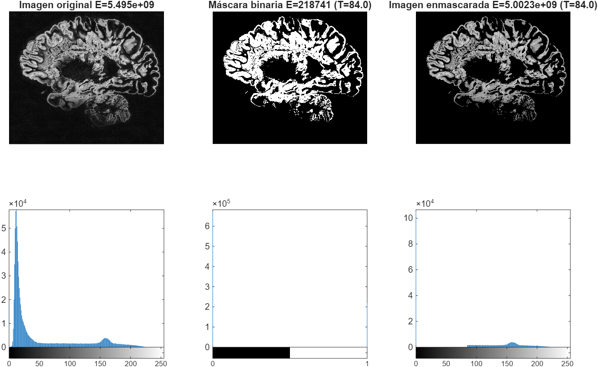

*Paso 3*: Comparar estos resultados con la implementación de Otsu (interclase) de Matlab: `graythresh()`

``` splus
Tn = graythresh(img);  % umbral normalizado [0,1]
T_mlab = 255 * Tn;     % a [0,255] para comparar
binaryMaskMatlab = imbinarize(img, Tn);
maskedImgML = img.* uint8(binaryMaskMatlab);

E_maskMatlab = calcularEnergia(binaryMaskMatlab);
E_maskedImgML = calcularEnergia(maskedImgML);

% Mostrar la máscara binaria de MATLAB
figure;
% images
subplot(2,4,1); imshow(img); title(sprintf('Imagen original E=%.5g', E_img));
subplot(2,4,2); imshow(mask); title(sprintf('Máscara binaria E=%g (T=%.1f)',E_mask, T));
subplot(2,4,3); imshow(maskedImg); title(sprintf('Masked mine E=%.5g (T=%.1f)', E_maskedImg, T));
subplot(2,4,4); imshow(maskedImgML); title(sprintf('Masked ML E=%.5g (T=%.1f)', E_maskedImgML, T_mlab));
% histograms
subplot(2,4,5); imhist(img); axis('tight');
subplot(2,4,6); imhist(mask); axis('tight');
subplot(2,4,7); imhist(maskedImg);
subplot(2,4,8); imhist(maskedImgML); title(sprintf('Histograma Otsu MATLAB'));

exportgraphics(gcf, 'results/ex_2_2.png', 'Resolution',150);
```

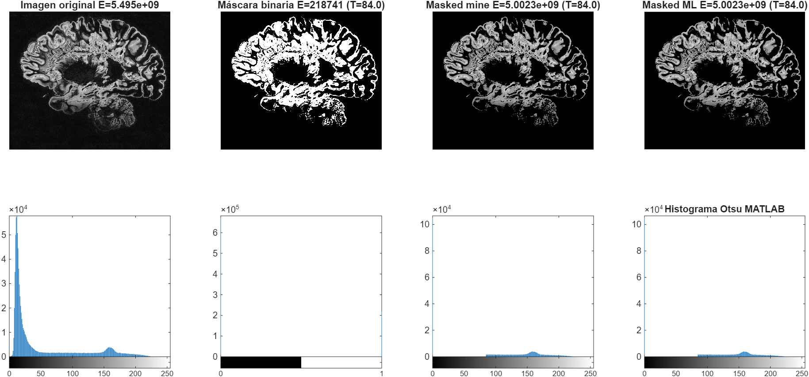

#### Observaciones

El único cambio entre el método de umbralización global normal y el global de Otsu es de un umbral 84.6 pasamos a 84.0, respectivamente. Esto no se nota a simple vista en las imágenes ni en sus histogramas.\
Si comparamos el metodo de umbralización global de Otsu realizado con nuestra función con la implementación de Otsu (interclase) de Matlab: `graythresh()` no vemos ninguna diferencia.

### Umbralización adaptativa con ventanas no solapadas o umbral por bloque (Otsu local)

Esto consiste en crear ventanas (no solapadas) e implementar la umbralización sobre cada una de las divisiones de tamaño $MxN$ de la imagen de entrada.

``` splus
% Procesado 2x2
tic; % medir tiempo

% Cargar img
img = imread('Imagenes_P3\MRI_gray.jpg');

% Definir nº de ventanas
num_blocks_vert = 2;   % ej: 2x2 = 4 ventanas
num_blocks_horz = 2;   % cambia a 2x3 (=6), 3x4 (=12), 4x4 (=16), etc.

% tamaño de bloque MxN
[H, W] = size(img);
M = ceil(H / num_blocks_vert); % filas_bloque = filas_imagen/ventanas_en_vertical
N = ceil(W / num_blocks_horz); % columnas_bloque = columnas_imagen/ventanas_en_horizontal;
  
% umbral por bloque (Otsu local)
f = @(block) UmbralizaOtsuIntra(block.data); 
% aplicar blockproc 
bw = blockproc(img, [M N], f);
% Generar imagen enmascarada
maskedImg = img .* uint8(bw);

% Calcular energías
E_img  = calcularEnergia(img);
E_mask  = calcularEnergia(bw);
E_maskedImg = calcularEnergia(maskedImg);

T_final = toc;

% Mostrar imagenes
figure;
subplot(2,3,1); imshow(img);        
    title(sprintf('Imagen original E=%.5g', E_img));
subplot(2,3,2); imshow(bw);         
    title(sprintf('mascara (otsu local):tiempo=%.3fs\n (%dx%d):M=%d x N=%d E=%g', ...
        T_final, num_blocks_vert, num_blocks_horz, M, N, E_mask));
subplot(2,3,3); imshow(maskedImg); 
    title(sprintf('Imagen enmascarada:\n (%dx%d):M=%d x N=%d E=%.5g', ...
        num_blocks_vert, num_blocks_horz, M, N, E_maskedImg));
subplot(2,3,4); imhist(img); axis('tight'); title('Hist. original');
subplot(2,3,5); imhist(bw); title('Hist. máscara (0/1)');
subplot(2,3,6); imhist(maskedImg); title('Hist. enmascarada');

exportgraphics(gcf, 'results/ex_3_2x2.png', 'Resolution',150);
```

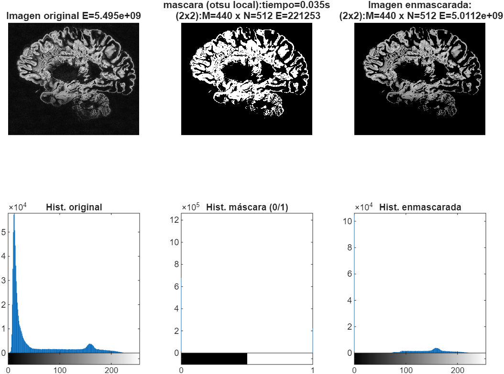

Experimentaremos con valores de M y N que resulten en el procesado de 4 - 16 ventanas rectangulares.

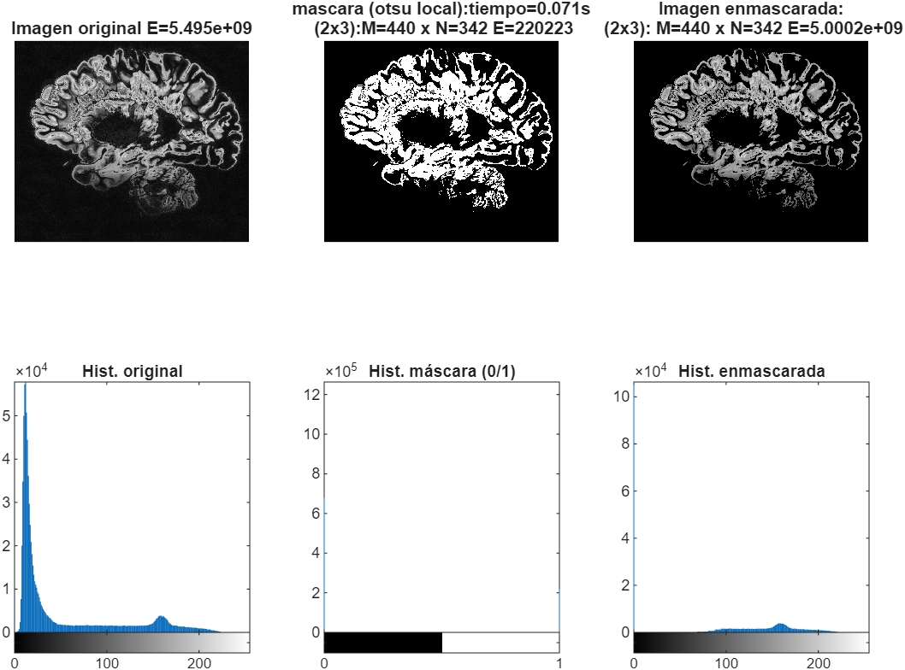 *6 ventanas*

------------------------------------------------------------------------

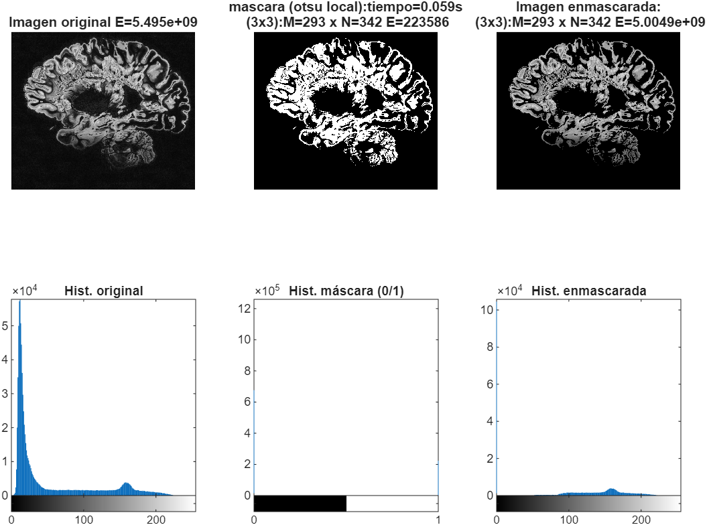 *9 ventanas*

------------------------------------------------------------------------

 *12 ventanas*

------------------------------------------------------------------------

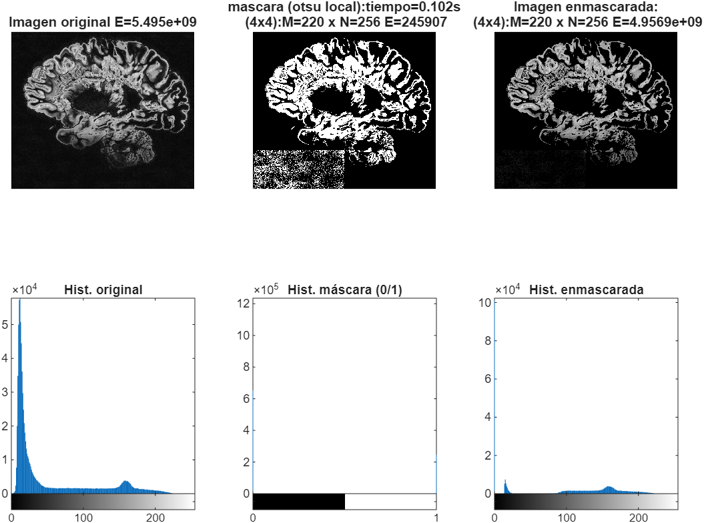 *16 ventanas*

------------------------------------------------------------------------

 *24 ventanas*

------------------------------------------------------------------------

#### Observaciones

Vemos que a partir de 16 ventanas los histogramas dejan de ser bimodales y muestran un tercer pico. Este defecto lo observamos en las imagenes como una zona granulada fuera de la zona de interés, que es más evidente si miramos el margen inferior de sus máscaras.

Por otro lado, las imágenes en las que se ha realizado una umbralización con ventanas inferiores a 12, generan un histograma muy similar, y los cambios entre ellas son muy mínimos. Aunque mirando con cuidado, (y quizás es más apreciable en la imágen de las máscaras) las ventanas de 3x3 y 3x4 son las que mejor realizan la umbralización sin perder la zona más oscura de la parte inferior de la imagen.


------------------------------------------------------------------------

## Detección y extracción de contornos

### Extracción de contornos por el método de Canny

Paso 1: Obtener imagen y pasarla a escala de grises
``` splus
img = imread('Imagenes_P3\Bowie.jpg');
I = rgb2gray(img);
```

Paso 2: Definimos umbral y sigma para el detector de contornos
``` splus
th = 0.1:0.1:0.6;
sigma = 0.2:0.2:2;
```

Paso 3: Creamos la función para plotear las multiples imágenes:
``` splus
function ax = subplottight(m,n,p)
% subplottight(m,n,p): márgenes compactos tipo subplot
gap    = 0.02;      % espacio entre celdas
marg_w = 0.04;      % margen lateral
marg_h = 0.04;      % margen superior/inferior

row = ceil(p / n);
col = p - (row-1)*n; 

% tamaño de cada celda
height = (1 - 2*marg_h - (m-1)*gap) / m;
width  = (1 - 2*marg_w - (n-1)*gap) / n;

% posición (fila 1 arriba, columna 1 izquierda)
left   = marg_w + (col-1) * (width + gap);
bottom = 1 - (marg_h + row*height + (row-1)*gap);

ax = axes('Position',[left bottom width height]);
end
```

Paso 4: Extraemos, mediante dos bucles `for` anidados, los contornos con diferentes parámetros:
``` splus
figure('Name','Contornos Canny');
it = 0;

for i = 1:numel(th)
    for j = 1:numel(sigma)
        % Extracción de contronos Canny
        E = edge(I, 'canny', th(i), sigma(j));
        E_img  = calcularEnergia(E);
        it = it + 1;
        % Mostramos los resultados
        subplottight(numel(th), numel(sigma), it);
        overlay = 0.5*double(I) + 255*double(E);
        imshow(uint8(overlay));
        title(sprintf('E=%.5g th=%.2f \n (low=%.2f) \\sigma=%.1f', ...
            E_img, th(i), 0.4*th(i), sigma(j)));
    end
end
```

**Resultado:**


**Observaciones:**

> La función E = edge(I, 'canny', thresh, sigma); tiene 4 parámetros: 'I' y 'canny' son la imagen y el método a utilizar respectivamente 'Thresh' es un vector con los valores del umbral de detección de bordes.\
> Vemos que a medida que aumentamos el umbral (threshold -th) nos volvemos más restrictivos, escogiendo unicamente los bordes más definidos. Mientras que con umbrales muy bajos obtenemos cosas que no forman parte del borde persé.\
> Esto lo podemos observar tambien en la energía de los bordes, que va disminuyendo a medidad que aumentamos el umbral.
> Por otro lado, 'Sigma' es la desviación típica del filtro gaussiano que aplica el algoritmo antes de calcular los gradiente. A medida que aumenta sigma, vemos que obtenemos una mejor conexión entre bordes, es decir, en una imagen con el mismo umbral pero mayor sigma los bordes parecerán más uniformes. Esto se debe a la mayor reducción de ruido.
>
> Con lo que podemos concluir que dependiendo de que bordes nos interesa extraer, eligiremos el umbral. Por ejemplo, para extraer el contorno de la cabeza y los ojos eligiremos umbrales y sigma alto. Mientras que para extaer detalles de la cara, como la boca, nostrils y las orejas, necesitamos usar umbrales intermedios.


------------------------------------------------------------------------


#### *El siguiente experimento es con la siguiente imágen de una muestra **citológica de microscopía óptica**.*

``` splus
img = imread('Imagenes_P3\cyto.jpg');

I = rgb2gray(img);      % Convertir a escala de grises
I_double = double(I);                

figure; 
subplot (1,3,1), imshow(img); title('Imagen citología-Color');
subplot (1,3,2), imshow(I); title('Imagen citología-BW');
subplot (1,3,3), imhist(I); title('BW-Histograma');
```


**Paso 1:** Para esta imagen hizo falta el siguiente pre-procesado:

``` splus
%% Preprocesado: Aumentar Contraste
% Parámetros
a = 0; b = 180; s_a = 0; s_b = 240;

% Aplicamos la función
[ima_proc,s]=modificarContraste(I_double,a,b,s_a,s_b);

% Mostrar resultados
figure; 
subplot (2,2,1), imshow(I); title('Cytology Image BW Original');
subplot (2,2,2), imshow(uint8(ima_proc)); title('Cytology Image BW Modified');
subplot (2,2,3), imhist(I); axis tight; title('Original Histogram');
subplot (2,2,4), imhist(uint8(ima_proc)); axis tight; title('Modified Histogram');
```


**Paso 2:** Ajustamos la función de ploteo a la forma del nuevo set de imágenes:

``` splus
% For CYTO pic
function ax = subplottight2(m,n,p)
% subplottight(m,n,p): márgenes compactos tipo subplot
gap    = 0;      % espacio entre celdas
marg_w = 0;      % margen lateral
marg_h = 0.04;      % margen superior/inferior

row = ceil(p / n);
col = p - (row-1)*n; 

% tamaño de cada celda
height = (1 - 2*marg_h - (m-1)*gap) / m;
width  = (1 - 2*marg_w - (n-1)*gap) / n;

% posición (fila 1 arriba, columna 1 izquierda)
left   = marg_w + (col-1) * (width + gap);
bottom = 1 - (marg_h + row*height + (row-1)*gap);

ax = axes('Position',[left bottom width height]);
end
```

**Paso 3:** Para la deteccion de contornos probamos distintos parámetros, nos quedamos con el rango central puesto que generaba mejores resultados:

``` splus
% th = 0.10:0.05:0.25;  
% sigma = 0.8:0.4:1.6;

th = 0.06:0.04:0.18;   % [0.06 0.10 0.14 0.18]
sigma = 0.6:0.4:1.4;      % [0.6 1.0 1.4]

% th = 0.14:0.06:0.32;   % [0.14 0.20 0.26 0.32]
% sigma = 1.2:0.4:2.0;      % [1.2 1.6 2.0]

figure('Name','Cytology Image-Contornos');
it = 0;
for i = 1:numel(th)
    for j = 1:numel(sigma)
        E = edge(ima_proc, 'canny', th(i), sigma(j));
        it = it + 1;
        subplottight(numel(th), numel(sigma), it);

        overlay = 0.5*double(ima_proc) + 255*double(E);
        imshow(uint8(overlay));
        axis off; set(gca,'LooseInset',[0 0 0 0])
        title(sprintf('th=%.2f (low=%.2f)  \\sigma=%.1f', ...
            th(i), 0.4*th(i), sigma(j)), 'Color','w');
    end
end
```

**Resultados:**


**Observaciones:**

> Las conclusiones anteriores se mantienen, sin embargo, ahora nos podemos dar cuenta cuan importante es un buen ajuste de umbral y sigma para ciertas imágenes. Puesto que de los 3 elegidos, solo uno funciona medianamente bien.